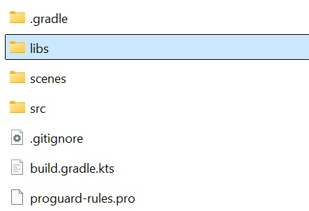

# Quickstart Guide
This guide introduces the basic steps required to integrate and initialize playback functionality using the SDK.

## 1. Import Package
Download the HISPlayer Meta Spatial SDK. Copy the `hisplayer-sdk-version.aar` file and place it in your project module’s libs/ directory. If that directory does not exist, create it manually.

<p align="center">

</p>

Then, add the following dependencies inside the `dependencies` block, in your project `build.gradle.kts` file.

```
// HISPlayer Dependencies
implementation(files("libs/hisplayer-sdk-1.1.0.aar"))
implementation("androidx.media3:media3-exoplayer:1.7.1")
implementation("androidx.media3:media3-exoplayer-hls:1.7.1")
implementation("androidx.media3:media3-exoplayer-dash:1.7.1")
implementation("androidx.media3:media3-ui:1.7.1")
implementation("org.bouncycastle:bcprov-jdk16:1.45")
implementation("androidx.annotation:annotation:1.9.1")
```

Finally, sync the project with Gradle files by selecting **Sync Project with Gradle Files** or using the shortcut `Ctrl + Shift + O`.

## 2. Configure HISPlayer
All public API classes of HISPlayer are located in the `com.hisplayer.sdk` package. You can import individual classes as needed, but for simplicity in this guide, we’ll import all of them using:

```
import com.hisplayer.sdk.*
```

`HISPlayerManager` is the central class used to control the player.
It provides all the necessary functionality for managing playback and interacting with the player.

This class can be declared as a `lateinit` variable and initialized later in your application. To initialize it, you must provide the `applicationContext` and a valid license key that you receive from HISPlayer. If you don't receive license key, please contact HISPlayer support. If the license key is invalid or missing, an exception will be thrown during initialization.

```
lateinit var hisPlayerManager: HISPlayerManager
```

```
try {
    hisPlayerManager = HISPlayerManager(this, "licenseKey")
}
catch (e: Exception) {
    Log.e(TAG, "Error creating HISPlayerManager, license key is invalid")
}
```

Once the class is instantiated, you can specify the desired log level: `DEBUG`, `INFO`, `WARNING`, `ERROR`, or `NONE`.

```
hisPlayerManager.setLogLevel(LogLevel.INFO)
```

### 2.1 Create HISPlayerController (Optional)
To control the player, you only need the `HISPlayerManager` class. However, this class defines several callback functions that are triggered by specific player events. These functions can be overridden to add custom behavior depending on your app’s requirements. A list of available events is provided in the API documentation.

In order to handle event callbacks, you should create a `HISPlayerController` class that extends `HISPlayerManager`, as shown below:

```
import com.hisplayer.sdk.*

/**
 * This is an example of how to expand the functionalities of HISPlayerManager
 */
class HISPlayerController(context: Context, license: String) :
    HISPlayerManager(context, license) {

    // Example of override function
    override fun eventPlaybackPlay(event: EventParams?) {
        super.eventPlaybackPause(event)
        Log.d(TAG, "The video has started playing")
    }
}
```

Then, in your application code, use `HISPlayerController` instead of `HISPlayerManager` directly.

## 3. Create a Stream
To create a stream, you need to use the `HISStreamProperties` class, which requires a `Surface`, a stream URL, and a `HISPlayerProperties` instance.

The `HISPlayerProperties` class defines playback options such as autoplay and the playback strategy, specified by the `HISPlaybackStrategy` enum.

Here's an example:

```
val stream = HISStreamProperties(
    surface,
    "https://api.hisplayer.com/media/hisplayer/ce77405f-d7c8-4523-95a4-b3715ec57a12/master.m3u8?contentKey=ScrVdlMh",
    HISPlayerProperties(
        true,                       // Autoplay (Boolean)
        HISPlaybackStrategy.LOOP    // PlaybackStrategy
    )
)
hisPlayerManager.addStream(stream)
```

Once the stream is created, you can use the playback control functions provided by the API, such as `hisPlayerManager.play(0)` or `hisPlayerManager.pause(0)`.

All of these functions take the playerIndex as their first parameter. If an invalid index is passed, the method will throw an error.

## 4. Create a Stream and MediaPanel Entity
To create as stream and MediaPanel to display video, you need to use the `HISStreamEntityProperties` class, which requires MediaPanel properties, stream URL, and `HISPlayerProperties` instance.
The `HISPlayerProperties` class defines playback options such as autoplay and the playback strategy, specified by the `HISPlaybackStrategy` enum.

Here's an example:

```
val streamProperty = HISStreamEntityProperties(
        "https://api.hisplayer.com/media/hisplayer/ce77405f-d7c8-4523-95a4-b3715ec57a12/master.m3u8?contentKey=ScrVdlMh",
        HISPlayerProperties(
            content.autoPlay,
            HISPlaybackStrategy.LOOP,
            0,
            1000000,
        )
    )

val playerEntity = hisPlayer?.addStreamWithEntity(
    content.key,
    streamProperty,
    HISPlayerVideoShapeTypes.Rectilinear,
    HISPlayerStereoTypes.None,
    size,
    position,
    rotation,
    true,
    content.fishEyeFOV ?: 1.0f) {
        if (content.syncContentKey != null) {
        hisPlayer?.setVolume(content.key, 0.0f)
        }
    }
    
playerEntity.entity.setComponents(listOf(Visible(true), Grabbable()))
```

## 4. Release HISPlayer
It is important to properly call the `hisPlayerManager.release()` method on the library before closing the application. This ensures that all internal resources are properly released.
